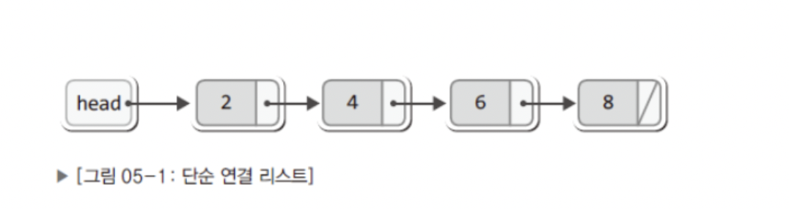
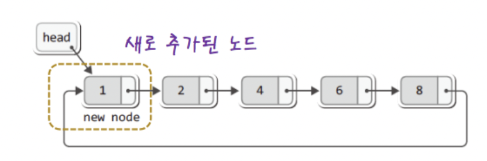

# Circular Linked List 

## 단순 연결 리스트

## 원형 연결 리스트

## 원형 연결 리스트에 머리에 노드 추가

## 원형 연결 리스트에 꼬리에 노드 추가

--- 

## 원형 연결 리스트의 구현

1. 삭제 (LRemove)
* 단순 연결 리스트와 동일

2. 조회 (LNext, LFirst) : 끝 없음
* LNext : 순환하는 형태로 변경하기

3. 삽입
* 머리 쪽 삽입과 꼬리 쪽 삽입이 가능하도록 함수 두 개 정의
 

