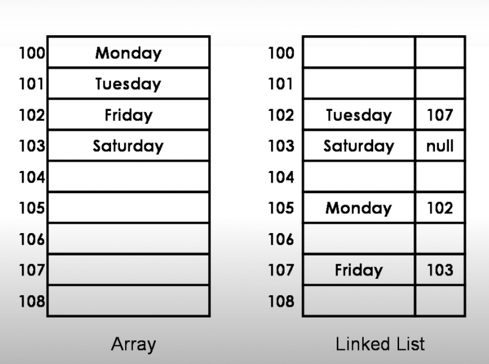
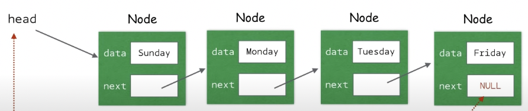
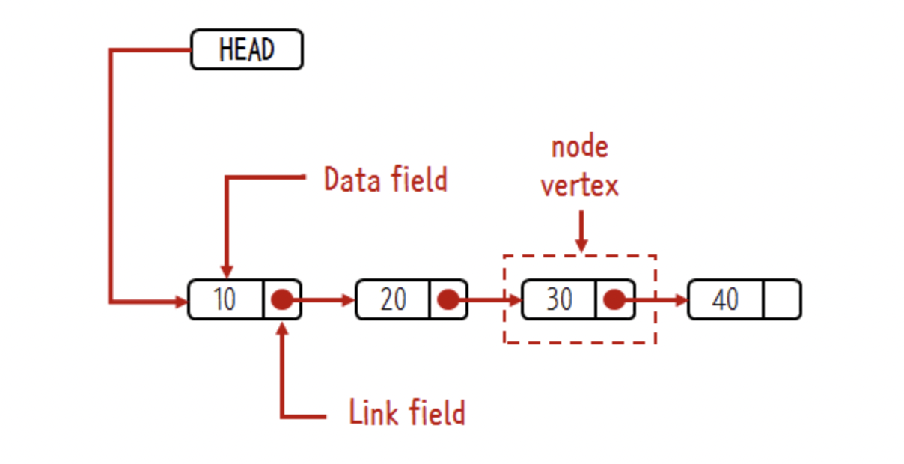
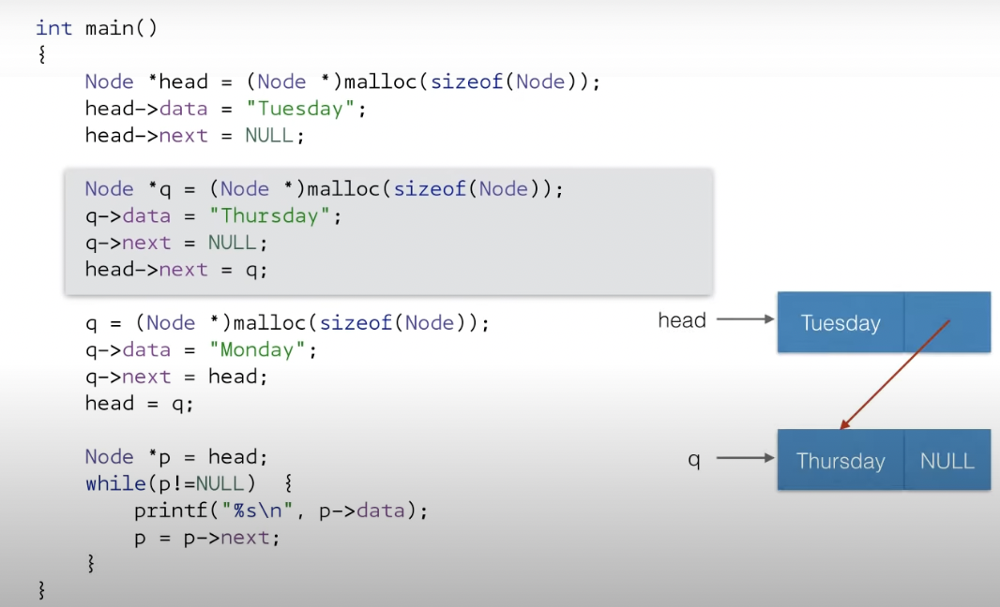
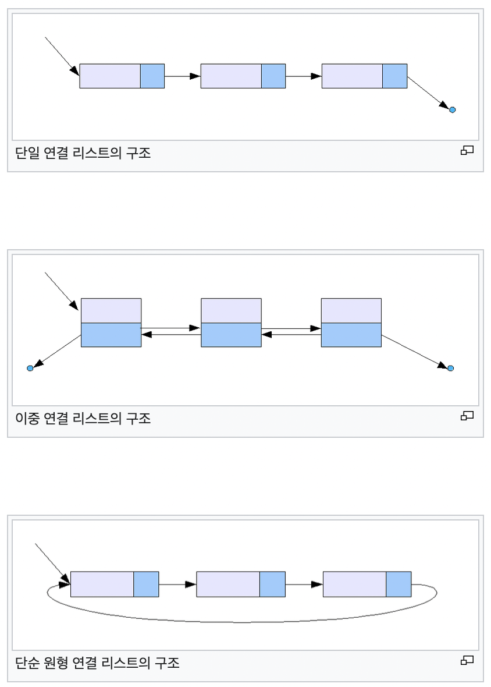

# List 

## Array List vs Linked List

1. Array List : 사무실 한 충 같이 쓰기    

* 배열을 기반으로 구현된 리스트
* 장점 : 랜덤 엑세스 가능함
* 단점 : 크기가 고정 돼 있음, Reallocation 필요함, 삽입, 삭제 시 다수의 데이터 옮겨야 함

 2. Linked List: 사무실 건물에 무작위 사무실 사용하기   

* 메모리 동적할당을 기반으로 구현된 리스트
* 장점 : 데이터의 이동 없이 삽입, 삭제 가능함
* 단점 : 랜덤 엑세스 불가능함 (물어 물어 가야됨)

---

### 연결 리스트? 
* 데이터를 담고있는 노드들이 연결 돼 있음
* 노드 = 자료 공간 + 포인터 공간
(데이터 필드 + 링크 필드)

---

* head   
  : 리스트의 출입문과 같은 것  
: 리스트를 사용하기 위해선 head 가 가리키는 노드 찾아야 함

---
* 예제 
 

--> : 원하는 값에 엑세스

---

### 종류

* 연결 리스트 (단일 연결 리스트)  
: 각 노드에 자료 공간과 한 개의 포인터 공간  
:  각 노드의 포인터는 다음 노드를 가리킴

* 이중 연결 리스트  
: 포인터 공간이 두 개가 있음  
: 각각 포인터는 앞의 노드와 뒤의 노드를 가리킴  
 
* 원형 연결 리스트  
: 일반적인 연결 리스트에 마지막 노드와 처음 노드를 연결시킨 원형의 구조
   

   ----

--- 

## 리스트 자료구조의 ADT 

### void ListInit(List *plist);
- 초기화할 리스트의 주소값을 인자로 전달
- 리스트 생성 후 제일 먼저 호출되어야 하는 함수

### void LInset(List *plist, LData data);
- 리스트에 데이터 저장, 매개변수에 data 전달된 값을 저장

### int LFirst(List *plist, LData *pdata);
- 첫 번째 데이터가 pdata가 가리키는 주소의 메모리에 저장
- 데이터의 참조를 위한 초기화 진행
- 참고 성공시 TRUE(1), 실패시 FALSE(0) 반환

### int LNext(List *plist, LData *pdata);
- 참조된 데이터의 다음 데이터가 pdata가 가리키는 메모리에 저장
- 순차적인 참조를 위해서 반복 호출이 가능
- 참조를 새로 시작하려면 먼저 LFirst 함수 호출
- 참고 성공시 TRUE(1), 실패시 FALSE(0) 반환

### LData LRemove(List *plist);
- LFirst 또는 LNext 함수의 마지막 반환 데이터를 삭제
- 삭제된 데이터는 반환 => 동적할당의 경우 메모리 반환해줘야하기때문
- 마지막 반환 데이터를 삭제하므로 연이은 반복 호출 허용 X

### int LCount(List *plist)
- 리스트 저장 되있는 데이터의 수 반환
