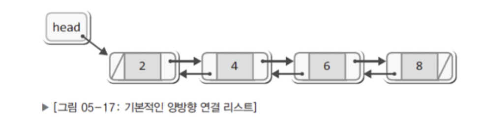
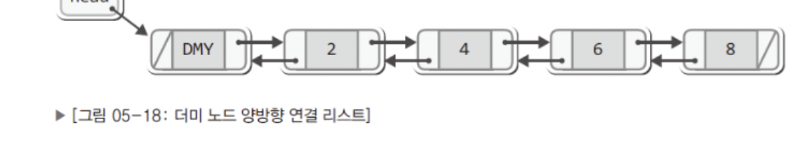
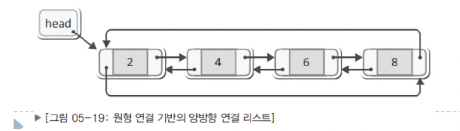

# 이중 연결 리스트 (양방향)

## 양방향 연결 리스트? 
* 노드가 양방향으로 서로 연결된 구조 




```c
typedef struct _node
{
    Data data;
    struct _node * next; 
    struct _node * prev;
} Node;
```

## 더미 노드 양방향 리스트



## 원형 기반의 양방향 연결 리스트

