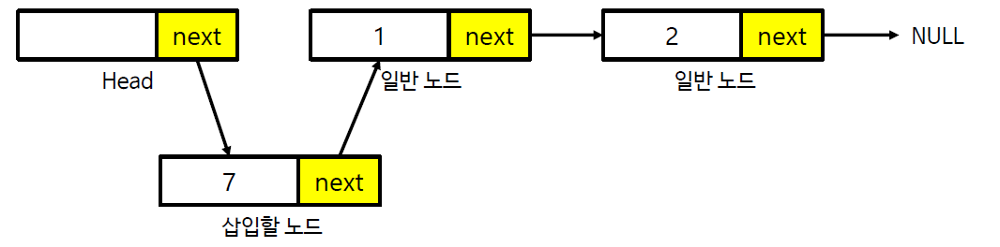

## Singly Linked List 
## (단일) 연결 리스트

* 연결리스트는 구조체와 포인터를 함께 사용해 구현
* 연결리스트는 리스트의 중간 지점에 노드를 추가하거나 삭제 가능
* 필요할 때마다 메모리 공간 할당(동적 할당)


```c
#include <stdio.h>
#include <stdlib.h>

int arr[INF]; // 거의 무한에 가깝다고 가정
int count = 0;

typedef struct {
	int data;
	struct Node* next;
} Node;

Node* head;

int main(void) {
	head = (Node*)malloc(sizeof(Node));
	Node* node1 = (Node*)malloc(sizeof(Node));
	node1->data = 1;
	Node* node2 = (Node*)malloc(sizeof(Node));
	node2->data = 2;
	head->next = node1;
	node1->next = node2;
	node2->next = NULL;
	Node* cur = head->next; 
	// cur에 저장된 위치를 통해 연결된 리스트들의 값들에 접근
	while (cur != NULL) {
		printf("%d ", cur->data);
		cur = cur->next;
	}
	system("pause");
	return 0;
}
```


1. 삽입

  


2. 삭제


```c
#include <stdio.h>
#include <stdlib.h>

typedef struct {
	int data;
	struct Node* next;
} Node;

Node* head;

// 삽입
void addFront(Node* root, int data) {
	Node* node = (Node*)malloc(sizeof(Node));
	node->data = data;
	node->next = root->next;
	root->next = node;
}

// 삭제
void removeFront(Node* root) {
	Node* front = root->next;
	root->next = front->next;
	free(front);
}

// 메모리 해제
void freeAll(Node* root) {
	Node* cur = head->next;
	while (cur != NULL) {
		Node* next = cur->next;
		free(cur);
		cur = next;
	}
}

// 리스트 값 출력
void showAll(Node* root) {
	Node* cur = head->next;
	while (cur != NULL) {
		printf("%d ", cur->data);
		cur = cur->next;
	}
}

int main(void) {
	head = (Node*)malloc(sizeof(Node));
	head->next = NULL;
	addFront(head, 2);
	addFront(head, 1);
	addFront(head, 7);
	addFront(head, 9);
	addFront(head, 8);
	removeFront(head);
	showAll(head);
	freeAll(head);
	system("pause");
	return 0;
}
```

이미지 출처
: [FE Developer](https://velog.io/@keemtj/%EC%9E%90%EB%A3%8C%EA%B5%AC%EC%A1%B0-%EB%A7%81%ED%81%AC%EB%93%9C-%EB%A6%AC%EC%8A%A4%ED%8A%B8Linked-List)

